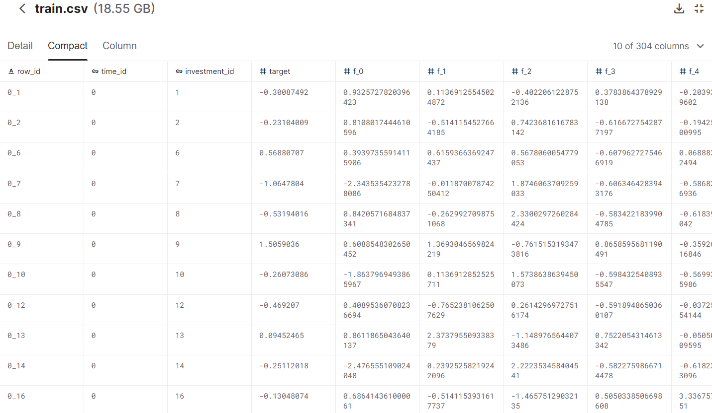

# Kaggle - Ubiquant Market Prediction

- ****Make predictions against future market data****

## 개요

---

### 배경 및 목적

- Regardless of your investment strategy, fluctuations are expected in the financial market. Despite this variance, professional investors try to estimate their overall returns. Risks and returns differ based on investment types and other factors, which impact stability and volatility. To attempt to predict returns, there are many computer-based algorithms and models for financial market trading. Yet, with new techniques and approaches, data science could improve quantitative researchers' ability to forecast an investment's return.
- In this competition, you’ll build a model that forecasts an investment's return rate. Train and test your algorithm on historical prices. Top entries will solve this real-world data science problem with as much accuracy as possible.

### 참고

- [https://www.kaggle.com/competitions/ubiquant-market-prediction](https://www.kaggle.com/competitions/ubiquant-market-prediction)

## 설명

---

- **사용언어** : `Python`
- **작업 툴** : `Kaggle Notebook`
- **사용 라이브러리** : `pandas`, `numpy`, `gc`, `tqdm`, `matplotlib`, `seaborn`, `scipy`, `sklearn`,    `lightgbm`
- **인원** : 1명
- **기간** : 2022.03.20 ~ 2022.04.12
- **내용** : feature 의 이름들이 가명으로 된 데이터를 활용하여 분석 및 시각화, Machine Learning를 이용한 예측 도출

### 분석 방향

- feature의 이름들이 가명화 되어 있어 각 feature가 무엇이고, feature들을 이용하여 새로운 feature를 생성하기 어려움
- 다양한 feature들을 시각화를 통해 분석
- 이상치를 찾아내어 분석및 예측의 정확성을 높이고자 함

## 데이터

---

- 총 304개의 컬럼
- 용량 : 18.55GB
- 미리보기

## 결과

---

- 프로젝트 결과물
    - [EDA](https://github.com/blackJJW/Kaggle/blob/main/ubiquant_prediction/ubiquant_1.ipynb)
    - [예측 및 제출](https://github.com/blackJJW/Kaggle/blob/main/ubiquant_prediction/ubiquant_2.ipynb)